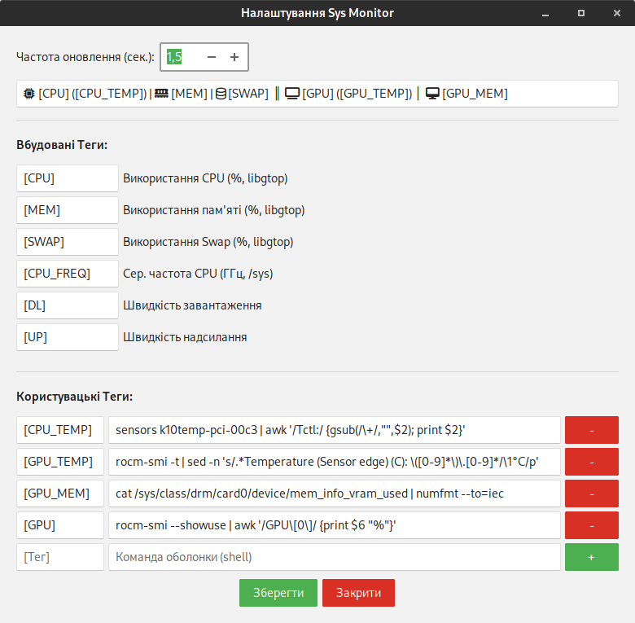
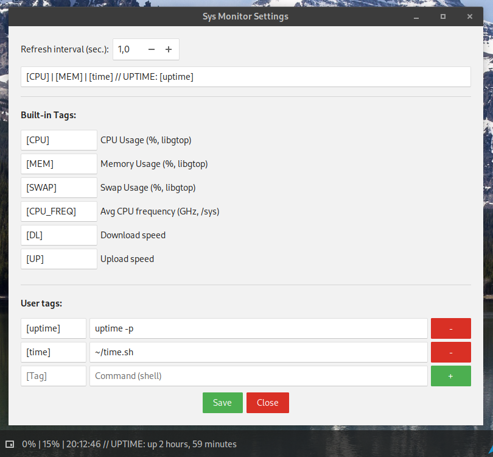
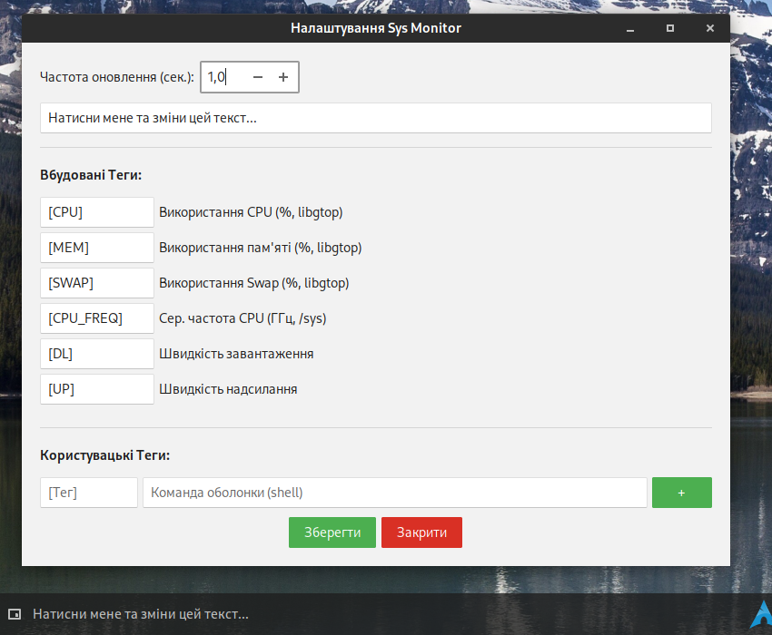

## Budgie SysMonitor Applet
System monitor applet for Budgie panel written in Vala with Gemini, Grok, Claude and ChatGPT.



<summary>🇬🇧 English Version</summary>

## Budgie SysMonitor Applet

A simple and configurable system monitor applet for the Budgie Desktop. Displays system info using built-in tags and custom shell commands.

<details>


<!--  -->
### Features

*   Customizable text template for displaying data.
*   Built-in tags: ```[CPU]```, ```[MEM]```, ```[SWAP]```, ```[DL]```, ```[UP]```, ```[CPU_FREQ]```.
*   Support for user-defined commands and tags (up to 10).
*   Configurable refresh interval.
*   Graphical settings window.
*   Supports CSS for appearance customization.

### Dependencies

*   **Runtime:** Budgie Desktop (>= 10.5), GTK+ 3, GLib, Libpeas, JSON-GLib, Libgtop.
*   **Build-time:** ```vala```, ```meson```, ```ninja```, ```gcc```, ```pkg-config```, and corresponding development files for the runtime libraries (dev/devel).

### Installation (from source, for the current user)

1.  Clone the repository:
    ```bash
    https://github.com/San4itos/budgie-sys-monitor.git
    cd budgie-sys-monitor
    ```
2.  Configure and build:
    ```bash
    meson setup builddir --prefix=$HOME/.local
    ninja -C builddir
    ```
3.  Install:
    ```bash
    meson install -C builddir
    ```
4.  Restart the Budgie Panel:
    ```bash
    budgie-panel --replace & disown
    ```
5.  Add "Sys Monitor" via Budgie Desktop Settings -> Panel -> Applets.

### Configuration

Left-click the applet to open settings. You can change the text template, refresh interval, and add/remove custom commands. Use the "Save" button to apply changes.

### Uninstall

1.  **Remove the applet from the Budgie panel** (via "Budgie Desktop Settings" -> "Panel").
2.  Run the uninstall command from your build directory (`builddir`) to remove the installed applet files:
    ```bash
    # From the project's root directory
    meson uninstall -C builddir
    ```
3.  **(Optional)** If you want to remove the user configuration file, delete the directory:
    ```bash
    rm -rf ~/.config/budgie-sys-monitor
    ```
4.  Restart the Budgie panel for changes to take effect:
    ```bash
    budgie-panel --replace & disown
    ```

### Authors

*   **San4itos**
*   *Assisted by:* Claude (Anthropic AI), Gemini (Google AI), Grok (xAI)

### License

MIT License (See LICENSE file for full text)

</details>

---

<summary>🇺🇦 Українська версія</summary>

## Budgie SysMonitor Applet

Простий та конфігурований аплет системного моніторингу для Budgie DE. Відображає системну інформацію за допомогою вбудованих тегів та користувацьких команд.

<details>


<!--  -->
### Можливості

*   Налаштовуваний рядок для відображення даних.
*   Вбудовані теги: ```[CPU]```, ```[MEM]```, ```[SWAP]```, ```[DL]```, ```[UP]```, ```[CPU_FREQ]```.
*   Підтримка користувацьких команд та тегів (до 10).
*   Налаштування інтервалу оновлення.
*   Графічне вікно налаштувань.
*   Підтримка CSS для кастомізації вигляду.

### Залежності

*   **Для роботи:** Budgie Desktop (>= 10.5), GTK+ 3, GLib, Libpeas, JSON-GLib, Libgtop.
*   **Для збірки:** ```vala```, ```meson```, ```ninja```, ```gcc```, ```pkg-config```, та відповідні файли розробки для бібліотек (dev/devel).

### Встановлення (з джерел, для користувача)

1.  Клонуйте репозиторій:
    ```bash
    git clone https://github.com/San4itos/budgie-sys-monitor.git
    cd budgie-sys-monitor
    ```
2.  Налаштування та збірка:
    ```bash
    meson setup builddir --prefix=$HOME/.local
    ninja -C builddir
    ```
3.  Встановлення:
    ```bash
    meson install -C builddir
    ```
4.  Перезапустіть панель Budgie:
    ```bash
    budgie-panel --replace & disown
    ```
5.  Додайте "Sys Monitor" через налаштування панелі Budgie.

### Налаштування

Клацніть лівою кнопкою миші на аплеті, щоб відкрити налаштування. Ви можете змінити шаблон тексту, інтервал оновлення, додати або видалити користувацькі команди. Зміни застосовуються кнопкою "Зберегти".

### Видалення

1.  **Видаліть аплет з панелі Budgie** (через "Налаштування Budgie Desktop" -> "Панель").
2.  Виконайте команду видалення у директорії збірки (`builddir`), щоб видалити встановлені файли аплету:
    ```bash
    # Перебуваючи у кореневій директорії проекту
    meson uninstall -C builddir
    ```
3.  **(Необов'язково)** Якщо ви хочете видалити конфігураційний файл користувача, видаліть директорію:
    ```bash
    rm -rf ~/.config/budgie-sys-monitor
    ```
4.  Перезапустіть панель Budgie, щоб зміни набули чинності:
    ```bash
    budgie-panel --replace & disown
    ```

### Автори

*   **San4itos**
*   *За участі:* Claude (Anthropic AI), Gemini (Google AI), Grok (xAI)

### Ліцензія

MIT License (Повний текст див. у файлі LICENSE)

</details>
